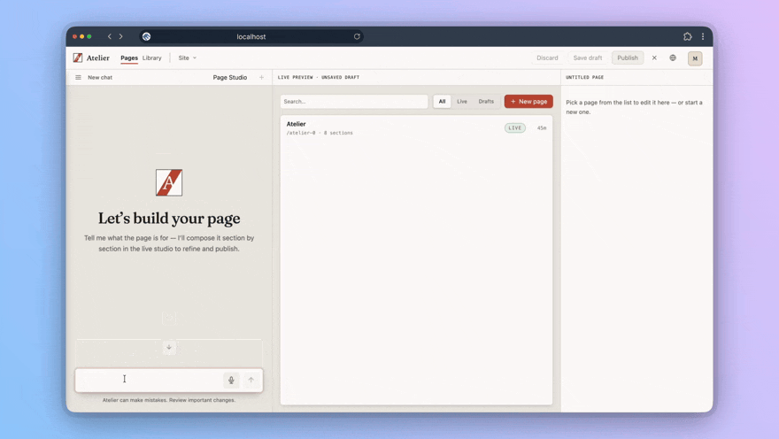

<p align="center">
  <picture>
    <source media="(prefers-color-scheme: dark)" srcset="assets/atelier-lockup-dark.svg">
    
  </picture>
</p>

<p align="center">
  <strong>Run your website by talking to it.</strong><br>
  The open-source, self-hosted, AI-native CMS — built on Drupal.
</p>

<p align="center">
  <a href="https://aincient-labs.com">Website</a> ·
  <a href="https://github.com/aincient-labs/atelier-cms">Source (atelier-cms)</a> ·
  <a href="https://aincient-labs.com/docs">Docs</a> ·
  <a href="https://www.drupalforge.org/">Drupal Forge</a>
</p>

<p align="center">
  
</p>

---

# Atelier — Drupal Forge (DevPanel) demo

A thin DevPanel wrapper that hosts a live, throwaway demo of **Atelier** on
[Drupal Forge](https://www.drupalforge.org/), with a **LiteLLM trial key wired in
automatically** so visitors don't need to bring their own AI key.

This repo carries **no product code**. The build grafts the Atelier tree straight out
of a **pinned, published `atelier-cms` image**, so the demo runs the exact artifact we
ship — and the only thing this layer adds is the trial-key wiring. The product itself
is unchanged and still boots keyless everywhere else.

## How it works

1. **Build** (GitHub Actions, `drupalforge/docker_publish_action`): this repo is laid
   over `devpanel/php:8.4-base`, [`.devpanel/Dockerfile`](.devpanel/Dockerfile) grafts
   `/opt/drupal` out of `ghcr.io/aincient-labs/atelier-cms:<pinned-tag>`, and
   [`.devpanel/init.sh`](.devpanel/init.sh) installs Atelier from `config/sync` against
   MySQL. The resulting database is baked in and the container committed as the demo
   image.
2. **Run** (DevPanel, registry mode): DevPanel starts that image, injects a **$1
   LiteLLM trial key** as `DP_AI_VIRTUAL_KEY`, and runs
   [`.devpanel/init-container.sh`](.devpanel/init-container.sh) → which imports the
   baked database and calls [`.devpanel/wire-ai.sh`](.devpanel/wire-ai.sh) to:
   - enable `ai_provider_litellm`,
   - store the key as an **env-provider** Key entity (`DP_AI_VIRTUAL_KEY`, read live —
     never persisted to config/State/DB, so it is never baked into the image) and point
     the provider at `DP_AI_HOST` (default `https://ai.drupalforge.org`),
   - bind the `reasoning` / `task` / `fast` / `vision` model roles per role, the way
     the onboarding wizard would (`image` left unbound so AI image generation is off),
   - mark onboarding complete so visitors land straight in the console.

Full detail, including every script and when it runs:
[`.devpanel/README.md`](.devpanel/README.md).

## Required demo environment

| Var | Value | Why |
|-----|-------|-----|
| `DP_AI_VIRTUAL_KEY` | *(DevPanel-injected trial key)* | The LiteLLM key. Unset ⇒ keyless demo (wizard shows). |
| `DP_AI_HOST` | `https://ai.drupalforge.org` | LiteLLM proxy base URL. |
| `WEB_ROOT` | `/var/www/html/web` | The docroot. The image defaults it, but set it explicitly. |

Optional, and the reason a wrong model ID never needs an image rebuild — `wire-ai.sh`
re-binds on every container start, so these can be set on the DevPanel app and take
effect on the next deploy:

| Var | Default (preference list) |
|-----|---------------------------|
| `DEMO_MODEL_REASONING` | `openai/gpt-5.4,anthropic/claude-haiku-4-5` |
| `DEMO_MODEL_TASK` | `gemini/gemini-flash-latest,openai/gpt-5.4-mini,anthropic/claude-haiku-4-5` |
| `DEMO_MODEL_FAST` | `openai/gpt-5.4-mini,gemini/gemini-flash-latest,anthropic/claude-haiku-4-5` |
| `DEMO_MODEL_VISION` | `gemini/gemini-3.5-flash,gemini/gemini-flash-latest,openai/gpt-5.4` |
| `DEMO_MODEL` | *(unset)* — if set, replaces all four with one model everywhere |

Each is a comma-separated **preference list**: `wire-ai.sh` asks the proxy which models
it actually offers (`/v1/models`) and binds the first one on the list that exists,
logging the full available list either way. The proxy — not this repo — decides which
model IDs are real, so this is how a rename shows up as one line in `logs/` instead of
as a demo that 404s on every turn.

## Version control (which build the demo runs)

The demo is pinned to a **specific `atelier-cms` image tag** via `ARG ATELIER_IMAGE`
in [`.devpanel/Dockerfile`](.devpanel/Dockerfile). Bumping that pin and pushing is how
we promote a new demo build, independent of `:edge` on `main`. Prefer an immutable tag
(`vX.Y.Z` or `sha-<short>`) over `:latest`/`:edge`.

## Testing it locally

```bash
./bin/build-local.sh                        # reproduces the CI build → atelier-demo:local
export ATELIER_DEMO_IMAGE=atelier-demo:local
docker compose -f .devcontainer/docker-compose.yml up
# http://localhost — admin / admin
```

Set `DP_AI_VIRTUAL_KEY` in your shell first to exercise the AI wiring. The repo also
opens directly as a VS Code dev container.

To run the image the way **DevPanel** does — including the app-root volume dance, a
Kubernetes-probe-shaped Host header, and an empty database — use the simulation harness.
It works against the published image, so a "the hosted demo is broken" report can be
reproduced locally instead of guessed at:

```bash
./bin/test-devpanel.sh                          # published image, all scenarios
IMAGE=atelier-demo:local ./bin/test-devpanel.sh # your local build
./bin/test-devpanel.sh freshdb                  # just one scenario
```

On a hosted instance itself, `.devpanel/doctor.sh` prints a full read-only diagnostic
(and writes it to `logs/`). See [`.devpanel/README.md`](.devpanel/README.md#diagnosing-a-hosted-instance).

## Notes

- **No AI image generation** in the demo: the LiteLLM proxy exposes no image model,
  so `roles.image` is left empty and the media/Library AI-generate affordances hide
  themselves (they don't error). Full text/page building + brand *tokens* work.
  Alt text and captions *do* work — that's the `vision` role, a chat call.
- Budget: the roles are split so the costly model is only used where it counts
  (`reasoning` — page and brand builds), with cheap models on everyday turns. That
  buys better output per turn than one budget model everywhere, but fewer turns per
  dollar than the old all-haiku-4.5 binding: expect the $1 trial to go less far than
  "3 pages + 1 brand". Watch the first hosted runs before quoting a number.
- Adapted from the reference [`drupalforge/drupal_cms_ai_demo`](https://github.com/drupalforge/drupal_cms_ai_demo).
